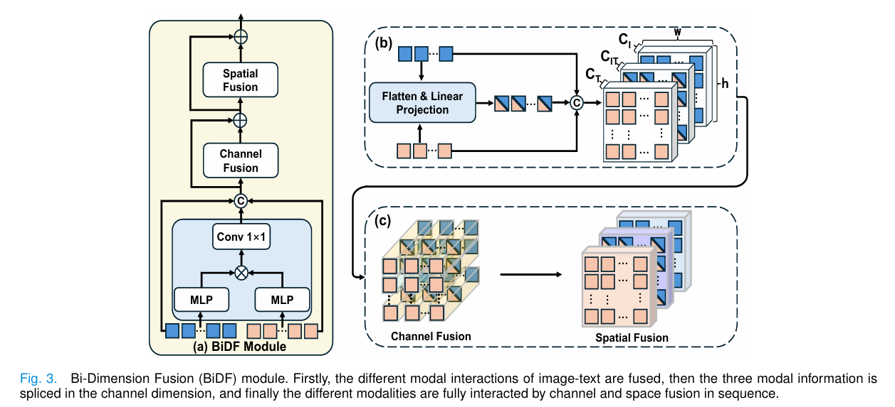

# TICoA

This repository provides the official implementation of the paper  
**“Text-Image Co-Alignment for Weakly Supervised Polyp Segmentation”**.

---


## Environment Setup

### Requirements
- Python 3.10.13
- PyTorch 2.1.1
- CUDA 11.8

### Create Conda Environment
```bash
conda create -n TICoA python=3.10.13
conda activate TICoA
```
### Install PyTorch
```bash
pip install torch==2.1.1 torchvision==0.16.1 torchaudio==2.1.1 \
  --index-url https://download.pytorch.org/whl/cu118
```
### Install Dependencies
```bash
pip install -r requirements.txt
```
### Build VMamba Dependency
```bash
cd selective_scan
pip install .
```

## Dataset

Set `trainer.dataset_choose` and the corresponding `dataset.<name>.data_root` in `config.yml`.

Supported datasets and their folder conventions:

- **CVC-ClinicDB** (`trainer.dataset_choose: CVC_ClinicDB`)
  - Loader: `src/CVCLoader.py`
  - `data_root` should contain:
    - `Original/` (images)
    - `GroundTruth/` (masks)
  - Note: please rename `Ground Truth` → `GroundTruth` if needed.
    
- **CVC-ColonDB** (`trainer.dataset_choose: CVC_ColonDB`)
  - Loader: `src/CVCLoader.py`
  - `data_root` should contain:
    - `images`
    - `masks`
  - Note: please rename `Ground Truth` → `GroundTruth` if needed.

- **Kvasir-SEG** (`trainer.dataset_choose: Kvasir_SEG`)
  - Loader: `src/CVCLoader.py`
  - `data_root` should contain:
    - `images/`
    - `masks/`

- **ETIS-LaribPolypDB** (`trainer.dataset_choose: ETIS-LaribPolypDB`)
  - Loader: `src/CVCLoader.py`
  - `data_root` should contain:
    - `images/`
    - `masks/`


### Hardware
NVIDIA GPU with CUDA 11.8 support is recommended.


## 🔍 Main Contributions

- **Text-Image Co-supervised Alignment Framework (TICoA):**  
  We propose a new weakly-supervised framework that utilizes easily accessible textual descriptions of medical images to reduce the dependence on pixel-level annotations, enabling text-supervised medical image segmentation via contrastive learning.

- **Fine-grained Text-Image Co-alignment Mechanism:**  
  We introduce a text-image co-alignment mechanism that achieves fine-grained semantic alignment by matching text segments with their corresponding image regions precisely.

- **Mamba-based Cross-modal Fusion Design:**  
  We adopt Mamba as the image encoder and design a Mamba Fusion module with a bi-dimension fusion strategy to achieve efficient and detailed cross-modal feature fusion.

## Overall Framework

<p align="center">
  
</p>

---

#### BiDF Module
<p align="center">
  
</p>

### Citation
If you find this work useful in your research, please consider citing our related paper:
```bash
@InProceedings{panmamba,
  author    = {Pan, Zhen and Huang, Wenhui and Zheng, Yuanjie},
  title     = {MAMBA-Based Weakly Supervised Medical Image Segmentation with Cross-Modal Textual Information},
  booktitle = {Medical Image Computing and Computer Assisted Intervention -- MICCAI 2025},
  year      = {2026},
  publisher = {Springer Nature Switzerland},
  address   = {Cham},
  pages     = {299--309},
  isbn      = {978-3-032-04984-1}
}
