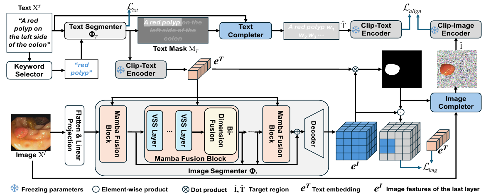

# TICoA

This repository provides the official implementation of the paper  
**“Text-Image Co-Alignment for Weakly Supervised Polyp Segmentation”**.

---

## Overall Framework

<p align="center">
  
</p>

---

## Environment Setup

### Requirements
- Python 3.10.13
- PyTorch 2.1.1
- CUDA 11.8

### Create Conda Environment
```bash
conda create -n TICoA python=3.10.13
conda activate TICoA
```
### Install PyTorch
```bash
pip install torch==2.1.1 torchvision==0.16.1 torchaudio==2.1.1 \
  --index-url https://download.pytorch.org/whl/cu118
```
### Install Dependencies
pip install -r requirements.txt

### Build VMamba Dependency
cd selective_scan
pip install .

### Hardware
NVIDIA GPU with CUDA 11.8 support is recommended.

### Citation
If you find this work useful in your research, please consider citing our related paper:
```bash
@InProceedings{panmamba,
  author    = {Pan, Zhen and Huang, Wenhui and Zheng, Yuanjie},
  title     = {MAMBA-Based Weakly Supervised Medical Image Segmentation with Cross-Modal Textual Information},
  booktitle = {Medical Image Computing and Computer Assisted Intervention -- MICCAI 2025},
  year      = {2026},
  publisher = {Springer Nature Switzerland},
  address   = {Cham},
  pages     = {299--309},
  isbn      = {978-3-032-04984-1}
}
